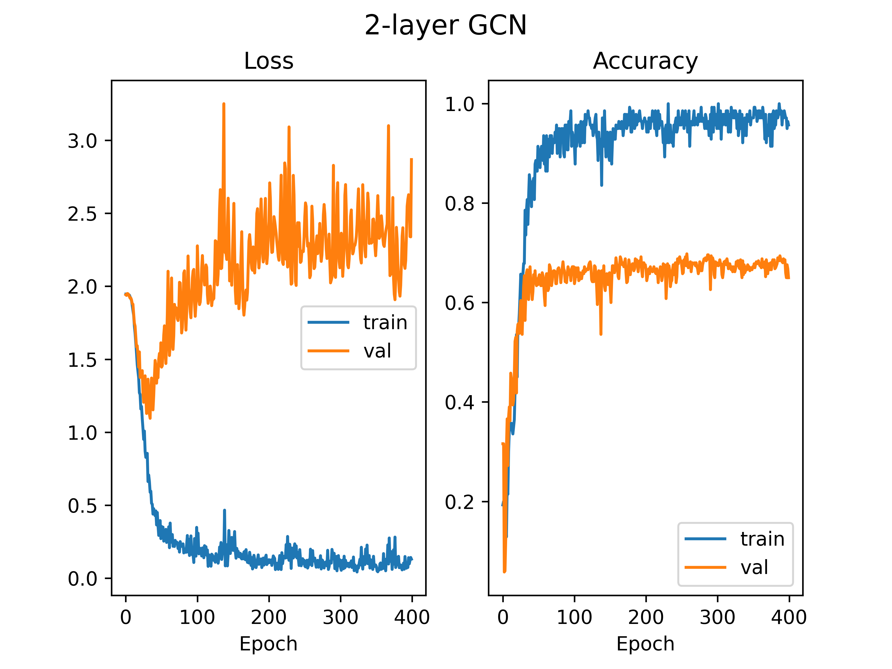

## Semi-supervised Classification with GCNs

This is a reimplemetation on Kipf, Welling's 2017 ICLR work. Please refer to the original paper on details and citing.

[link](https://tkipf.github.io/graph-convolutional-networks/)

#### files

- dataset.py
- exec.py (main program)
- init.py
- model.py
- training.py
- visualize.py
- readme.md

#### envs
- python		 3.9.10
- torch              1.10.2
- torch-geometric    2.0.4
- torch-scatter      2.0.9
- torch-sparse       0.6.13
- typing_extensions  4.1.1
- wheel              0.37.1
- numpy              1.22.2
- matplotlib         3.5.1

#### dataset

Download Cora dataset automatically with code. Do remind the directory of the download.

#### execution

Run exec.py

#### Results

original (acc: 82.3%)

with 5 layers (acc: 77.6%)

5 layers with up&down sampling (acc: 66.1%)

with 8 layers (acc: , 27.7%)

